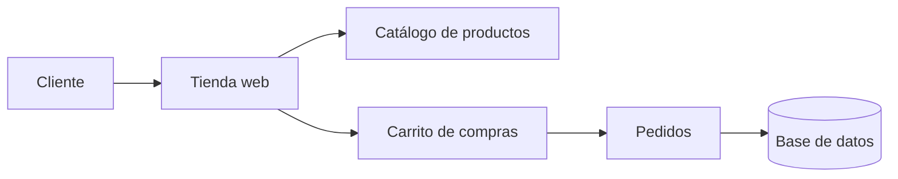

# TecsupStore


El proyecto fue creado como práctica para aprender a documentar proyectos utilizando Markdown y GitHub.

## Tabla de contenidos

- [Descripción](#descripción)
- [Instalación](#instalación)
- [Uso](#uso)
- [Estado de funcionalidades](#estado-de-funcionalidades)
- [Pendientes](#pendientes)
- [Arquitectura](#arquitectura)
- [Contribuidores](#contribuidores)

## Descripción 
TecsupStore es una tienda en línea donde los usuarios pueden consultar productos y realizar pedidos.

## Instalación

Para instalar el proyecto, primero se debe clonar el repositorio y luego ingresar a la carpeta.

```bash
git clone https://github.com/milagrosramosr/laboratorio-readme.git
cd laboratorio-readme
npm install
```

##  Uso

Para iniciar la aplicación se utiliza el siguiente comando:

```bash
npm start
```

Una vez iniciada la aplicación, el usuario puede consultar los productos, agregarlos al carrito y gestionar sus pedidos.

## Estado de funcionalidades

| Funcionalidad | Estado |
|---|---|
| Inicio de sesión |  Listo |
| Catálogo de productos | Listo |
| Carrito de compras | En progreso |
| Gestión de pedidos | En progreso |
| Reportes de ventas | Pendiente |

## Pendientes

- [x] Crear la estructura inicial del proyecto
- [x] Diseñar el catálogo de productos
- [ ] Implementar el carrito de compras
- [ ] Implementar la gestión de pedidos
- [ ] Agregar reportes de ventas
- [ ] Mejorar el diseño de la tienda

## Arquitectura 

## Contribuidores

| Nombre | Usuario de GitHub |
|---|---|
| Milagros Ramos | [@milagrosramosr](https://github.com/milagrosramosr) |